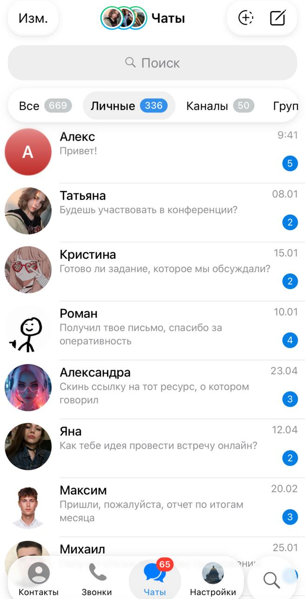
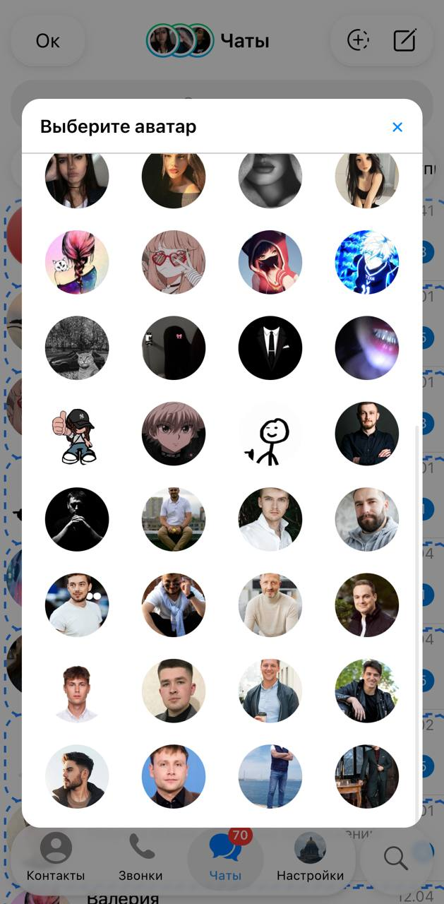
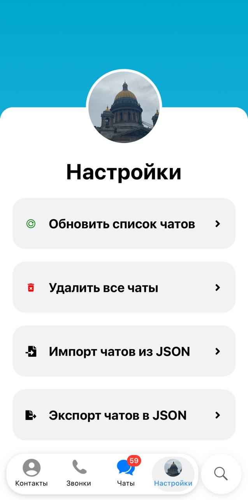

# TeleMock Core

<p align="center">
  
</p>

<p align="center">
  <b>Open-source Telegram mockup generator</b>
</p>

<p align="center">
  Create realistic Telegram-style conversations for content, marketing and presentations.
</p>

<p align="center">
  🚀 Try online: <a href="https://telemock.vercel.app">telemock.vercel.app</a>
</p>

<p align="center">
  🇷🇺 Русский | 🇬🇧 English
</p>

# 🇬🇧 English

## About

TeleMock Core is an open-source Progressive Web App for creating realistic Telegram-style chat mockups.

It allows users to create and customize conversations without using graphic editors like Photoshop or Figma.

The project can be used for:

- SMM content
- marketing cases
- presentations
- educational examples
- product demonstrations

## ✨ Features

### Telegram-style interface

- Modern Telegram-inspired UI
- Chat list visualization
- User profiles and avatars
- Message rendering

### Chat customization

- Generate demo conversations
- Edit messages
- Change usernames
- Change avatars
- Customize message time
- Configure message status

### Data management

- JSON import/export
- Local project storage
- Configuration sharing

### Progressive Web App

- Install as an application
- Mobile optimized
- Works directly in browser

<h2>🖼 Screenshots</h2>

<p align="center">
  
  
  
</p>

<p align="center">
  Telegram-style chat list · Chat editor · Application settings
</p>

## 🛠 Tech Stack

- React
- TypeScript
- Vite
- Vite PWA
- CSS

## 🚀 Installation

Requirements:

- Node.js 20+
- pnpm

Clone repository:

```bash
git clone https://github.com/YOUR_USERNAME/telemock-core.git

cd telemock-core

pnpm install
```

Run development server:

```bash
pnpm dev
```

## 🗺 Roadmap

- [x] Telegram-style interface
- [x] Chat generation
- [x] Message editor
- [x] Avatar customization
- [x] JSON import/export
- [x] PWA support

Future plans:

- [ ] Export chats as images
- [ ] More templates
- [ ] AI-powered generation
- [ ] Cloud synchronization

## 🤝 Contributing

Issues, suggestions and improvements are welcome.

Feel free to open an issue or submit a pull request.

## ⭐ Support

If you like this project, consider giving it a star ⭐

---

# 🇷🇺 Русский

## О проекте

TeleMock Core — это open-source PWA-приложение для создания реалистичных макетов Telegram-чатов.

Приложение позволяет создавать и редактировать диалоги в стиле Telegram без использования Photoshop или Figma.

Проект подходит для:

- SMM-специалистов;
- маркетологов;
- создания кейсов;
- презентаций;
- образовательных материалов;
- демонстрации продуктов.

## ✨ Возможности

### Интерфейс Telegram

- Современный интерфейс в стиле Telegram;
- Отображение списка чатов;
- Пользователи и аватары;
- Отображение сообщений.

### Редактор чатов

- Генерация демонстрационных диалогов;
- Изменение сообщений;
- Изменение имени и аватара;
- Настройка времени сообщений;
- Настройка статусов сообщений.

### Работа с данными

- Импорт JSON;
- Экспорт JSON;
- Сохранение конфигураций.

### PWA

- Установка как приложение;
- Работа в браузере;
- Оптимизация под мобильные устройства.

## 🛠 Технологии

- React
- TypeScript
- Vite
- Vite PWA

## 🗺 Roadmap

Сделано:

- [x] Telegram UI
- [x] Генерация чатов
- [x] Редактор сообщений
- [x] Настройка аватаров
- [x] JSON импорт/экспорт
- [x] PWA

Планы:

- [ ] Экспорт изображений
- [ ] Библиотека шаблонов
- [ ] AI-генерация диалогов
- [ ] Облачное хранение проектов

## 🤝 Участие

Буду рад идеям, предложениям и сообщениям об ошибках.

Создавайте Issues или Pull Requests.
